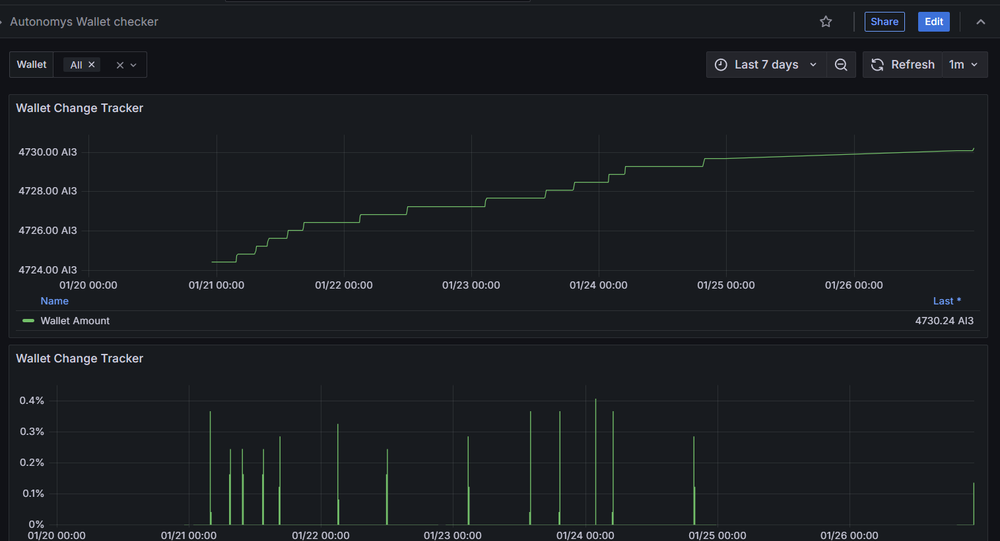
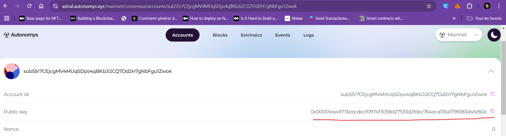

# Autonomys Wallet Checker

**Autonomys Wallet Checker** is a tool designed to periodically harvest on-chain data from an Autonomys node to track wallet balances over time. Initially built for personal use to monitor how changes in my setup influenced my income, it evolved into a tool that could help others analyze and improve their performance as well.



## Features

- **Monitor Wallet Balances**: Keep track of your Autonomys wallet balance and its changes over time.
- **Performance Insights**: Derivatives of balance changes provide a clear picture of how well your setup is performing.
- **Grafana Integration**: Visualize wallet data using pre-built dashboards.
- **Easy Registration**: Quickly register or unregister your wallet addresses using simple API endpoints.

## How It Works

### Components

This project uses:

- **Minotor API** ([GitHub Repo](https://github.com/Tocard/Minotor)): Handles interactions with Autonomys nodes via the following API endpoints:

````go
	Autonomys := server.Group("/autonomys")
	{
		AutonomysWallet := Autonomys.Group("/wallet")
		AutonomysWallet.GET("/harvest", routes.AutonomysHarvestWallet)
		AutonomysWallet.GET("/register/:wallet", routes.RegisterWallet)
		AutonomysWallet.GET("/unregister/:wallet", routes.UnRegisterWallet)
		AutonomysWallet.GET("/list", routes.ListWallet)
	}
````


- **Elasticsearch**: Stores harvested wallet data in a time-series format.
- **Grafana**: Displays wallet data and performance metrics through dynamic dashboards.

### Registration

You need your **public key address**, which can be found here:
[Autonomys Accounts](https://astral.autonomys.xyz/mainnet/consensus/accounts/replace_with_your_address).

#### Register Your Wallet

Replace `replace_with_your_address` in the URL with your wallet's public key:

https://mythologic.fr/minotor/autonomys/wallet/register/replace_with_your_address


#### Unregister Your Wallet

If you no longer want your wallet monitored, replace `replace_with_your_address` in the URL:

https://mythologic.fr/minotor/autonomys/wallet/unregister/replace_with_your_address


#### Check Your Wallet Registration

View all wallets currently being monitored:


### Visualizing Your Data

Once your wallet is registered, access the Grafana dashboard:
[Autonomys Wallet Checker Dashboard](https://mythologic.fr/grafana/d/bealjrejbeg3ke/autonomys-wallet-checker?orgId=7&from=now-2d&to=now&timezone=browser&var-Wallet=$__all&refresh=1m).

The dashboard includes:
1. **Balance Over Time**: Track your wallet's balance history.
2. **Performance Graph**: A derivative of the balance, highlighting periods of high performance.

## How It Works Behind the Scenes

1. The **Minotor API** queries Autonomys nodes to retrieve wallet balances.
2. The harvested data is formatted and stored as Elasticsearch documents for time-series analysis.
3. Grafana reads the data from Elasticsearch to render real-time visualizations.

---

Feel free to reach out if you encounter any issues or have suggestions for improvements!

---

## Additional Notes

### Run It Yourself

I will keep this service running for free, but if you’d like to set it up on your own infrastructure, you’ll need the following:
- An Elasticsearch cluster.
- Grafana for visualization.
- Minotor ([GitHub Repo](https://github.com/Tocard/Minotor)) or another tool to query your Autonomys node.
- An Autonomys node to provide on-chain data.

### Data Retention

As I am running this service on my own infrastructure, storage space is limited. Currently, I retain data for **60 days only**. After this period, older data will be removed to conserve resources.

Feel free to reach out if you encounter any issues or have suggestions for improvements!